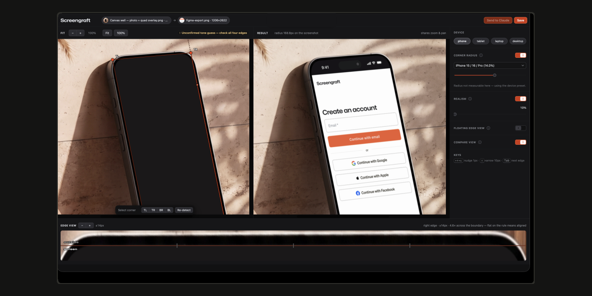
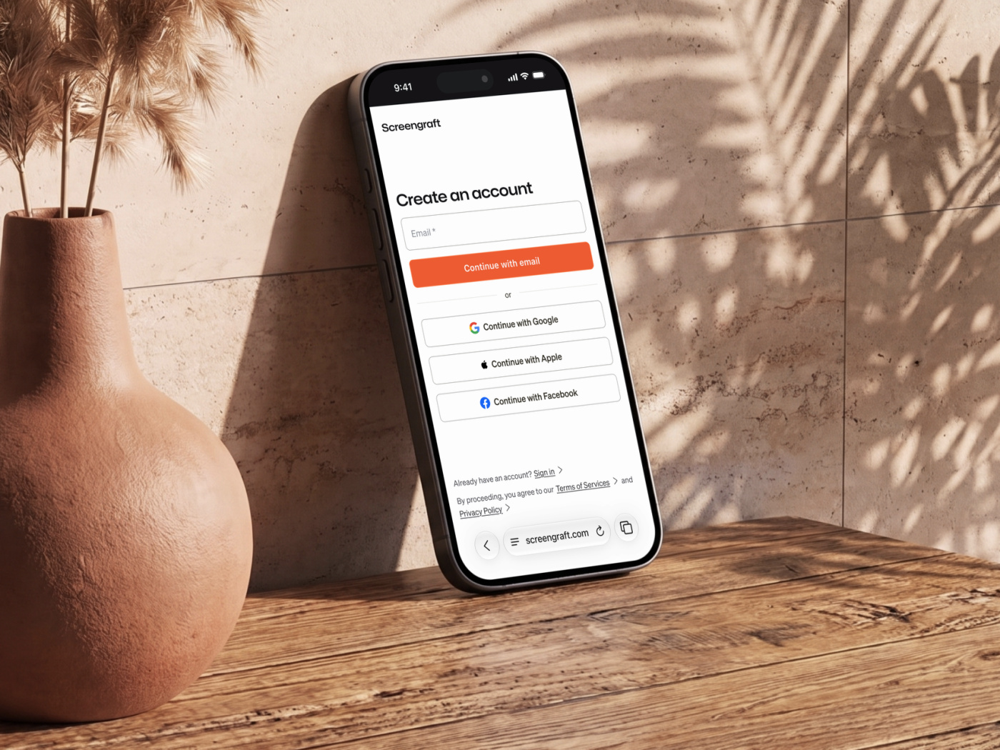

# screengraft

**Put a UI screenshot onto a photographed screen so the perspective is exactly right.**





Every device mockup is a compromise. Templates give you three angles and someone
else's lighting. Generative tools give you a screen that looks *like* your design
without being it — text reflowed, a button moved, a logo subtly wrong.

screengraft takes your photograph and your screenshot and computes the projective
transform between them. The screenshot lands on the glass because the geometry
says it must, not because a model thought it looked about right. Same inputs,
same output, every time.

---

## What it does

- **Any angle.** A homography handles arbitrary perspective — a phone leaning on
  a wall, a laptop half-turned, a tablet held at 40°.
- **Your pixels, unaltered.** The screenshot is resampled once and warped once.
  9px legal copy stays legible.
- **Rounded corners that actually follow the bezel**, measured from the photo or
  taken from a device preset.
- **Realism pass** *(optional)* — matches the screen's white balance and grain to
  the light in the room, and can lift the device's real reflections from a
  screen-off frame of the same shot.
- **You confirm every fit.** Detection is advisory and says so; you drag the four
  edges onto the glass with a magnified loupe. A silent misdetection producing a
  confident, wrong result is the one failure this tool refuses to have.

## Requirements

`python3` with **OpenCV** and **numpy**. OpenCV is the engine — nothing runs
without it. The installer provisions an isolated venv at `~/.screengraft/venv`
and never touches your system Python.

## Install as a Claude Code / Cowork plugin

```
/plugin marketplace add seq000/screengraft
/plugin install screengraft@fraczyk-tools
```

That route tracks versions and updates itself. If you would rather not add a
marketplace, download `screengraft-<version>.plugin` from
[the latest release](https://github.com/seq000/screengraft/releases/latest) and
open it, or clone this repo and point Claude Code at the folder.

Then ask Claude to inject a screenshot onto a photo. It opens a local page in
your browser, you fit the edges, press Save, and the composite lands in your
project folder. Nothing is uploaded anywhere; the page is served from
`127.0.0.1`.

## Or use it without Claude

```bash
npx screengraft --out-dir ./mockups
```

npm is a delivery mechanism here, not a claim about the language: the tool is
Python and OpenCV, and `bin/screengraft.js` is a launcher. It installs nothing
behind your back — if the engine is missing it prints the one command that
builds it (`npx screengraft --install`) and exits.

From a clone:

```bash
python3 scripts/preflight.py --install        # one-time: creates the venv
python3 scripts/ui.py --out-dir ./mockups     # opens the fitting page
```

Headless, if you already know the corners:

```bash
python3 scripts/warp.py --photo shot.jpg --screenshot ui.png \
  --corners "945,504 1310,475 1501,1408 1135,1459" \
  --radius-frac 0.14 --out composite.png
```

Corners are `TL TR BR BL` in photo pixels.

## Why not just use AI

A diffusion model cannot guarantee the screenshot lands on the screen's four
corners, because nothing in it is solving for that. A projective transform can,
by construction — it is the same maths a document scanner uses to flatten a page.
So the pipeline is computer vision and projective geometry end to end, and it is
deterministic: re-run it and you get a byte-identical file.

Generative AI has exactly one optional job in the design, and it is strictly
outside the screen mask. It never touches the pixels you designed.

## How it works

1. **Corner acquisition** — an advisory detector proposes a quad; you correct it
   by dragging *edges* (a rounded corner has no point to aim at; the straight
   edges either side are unambiguous), with a rectified strip loupe at ~5×.
2. **Warp** — the screenshot is area-averaged down to its destination footprint,
   then warped once at the photo's resolution. Prefiltering matters: OpenCV's
   warp never area-averages, so warping a 1206×2622 screenshot into a 226×454
   quad without it turns body text into noise.
3. **Realism pass** *(optional)* — white balance and exposure toward the
   surrounding light, grain matched to the photo's own noise floor, real
   speculars lifted from a screen-off reference.

## Roadmap

Done: manual warp, advisory detectors, the fitting workbench, the realism pass.

Open: video tracking (M3), SAM 2 auto-detect (M4 — built and measured in a
separate repo; it currently segments the phone body rather than the glass, so it
is not shipped), occluder matte (M5), so a finger in front of the screen stays in
front.

## Contributing

See [CONTRIBUTING.md](CONTRIBUTING.md). The short version: there are tests, they
run in CI, and a change to the compositing engine needs a measurement, not an
opinion.

## Licence

MIT. The bundled Mona Sans subset is SIL OFL — see `ui/fonts/OFL.txt`.
